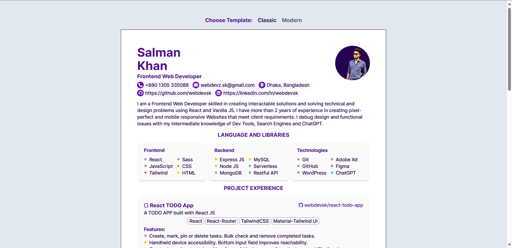
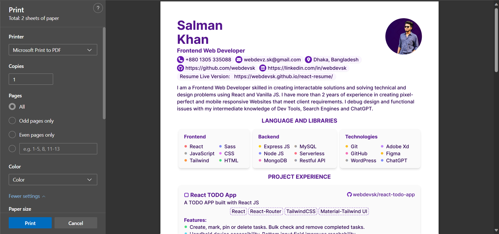
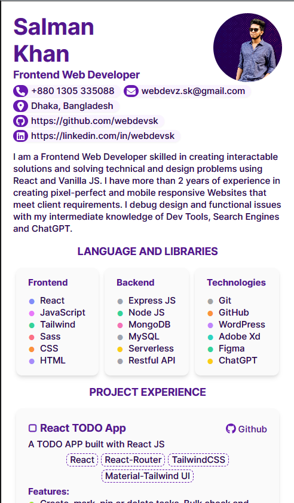

<!-- Replace these using search repo_name, project_title, short_description, project_description, view_demo_link -->
<!-- Prepend a hash # to filter active ones -->
<!-- Improved compatibility of back to top link: See: https://github.com/othneildrew/Best-README-Template/pull/73 -->

<a name="readme-top"></a>

<!-- PROJECT SHIELDS -->
<!--
*** https://www.markdownguide.org/basic-syntax/#reference-style-links
-->
<!-- [![Contributors][contributors-shield]][contributors-url]
[![Forks][forks-shield]][forks-url]
[![Stargazers][stars-shield]][stars-url]
[![Issues][issues-shield]][issues-url]
[![MIT License][license-shield]][license-url]
[![LinkedIn][linkedin-shield]][linkedin-url] -->

<!-- PROJECT LOGO -->
<br />

<div align="center">
  <a href="https://github.com/webdevsk/react-resume">
    
  </a>

<h3 align="center">React Resume</h3>

  <p align="center">
    Build Resume/CV with React JS
    <br />

[**Explore the docs »**](https://github.com/webdevsk/react-resume)

[View Demo](https://webdevsk.github.io/react-resume/)
· [Report Bug](https://github.com/webdevsk/react-resume/issues)
· [Request Feature](https://github.com/webdevsk/react-resume/issues)

  </p>
</div>

---

<!-- TABLE OF CONTENTS -->
<details>
<summary>Table of Contents</summary>
<br />

- [About The Project](#about-the-project)
  - [Built With](#built-with)
- [Getting Started](#getting-started)
  - [Prerequisites](#prerequisites)
  - [Hosting the live version](#hosting-the-live-version)
  - [Generating PDF file](#generating-pdf-file)
- [Contributing](#contributing)
- [License](#license)
- [Contact](#contact)

</details>
<br/>

<!-- ABOUT THE PROJECT -->

## About The Project

<div align="center">

<table>
<tr valign="bottom">
<td>

<p align="center">Live Desktop</p>
<td>

<p align="center">Print to PDF</p>
<td>

<p align="center">Live Mobile</p>
</td>

</tr>
</table>

</div>
<br/>

If you have any prior experience creating your Resume/CV using visual tools then you know how complicated things can be. As,

- You can't change the fonts globally
- Change of design requires that you fill in your details again
- Content and column alignment calculations have to be done manually

As a programmer, I like to solve my problems programmatically. So I created this React App to generate it dynamically. It features:

- A single Object to hold and manage all the information
- Ability to create multiple templates without the need of refilling the information
- Change font family and font sizes from Template.css file
- Loop through information and render them accordingly
- Use React conditional rendering to render content only on given information
- Create expandable columns with the help of CSS Grid and Flex-box
- Can host a Live interactive version of my resume for Desktops and Mobile devices

<p align="right">(<a href="#readme-top">back to top</a>)</p>

### Built With

[![React][React]][React-url]  
[![TailwindCSS][TailwindCSS]][Tailwind-url]

<p align="right">(<a href="#readme-top">back to top</a>)</p>

<!-- GETTING STARTED -->

## Getting Started

### Prerequisites

1. **Install** [NODE.JS](https://nodejs.org/en/download) and [Git](https://git-scm.com/downloads)
1. Open your projects base folder and launch any **terminal** of your choice.
1. Run this command:

   ```sh
   npm install npm@latest -g
   ```

### Hosting the live version

<!-- 1. Get a free API Key at [https://example.com](https://example.com) -->

1. Clone the repo

   ```sh
   git clone https://github.com/webdevsk/react-resume.git
   ```

1. Install NPM packages

   ```sh
   npm install
   ```

1. Run Dev server

   ```js
   npm run dev
   ```

### Generating PDF file

There are two ways in which you can generate a PDF file from the hosted live version. The differences are:

|                  | Browser Print to PDF            | Puppeteer PDF Method       |
| ---------------- | ------------------------------- | -------------------------- |
| Difficulty       | Easy                            | Hard                       |
| Method           | Snapshot (image)                | Generates from HTML markup |
| OCR              | No (Requires post OCR)          | Yes                        |
| Foreign language | Post-OCR may not recognise them | Supported                  |
| HyperLinks       | Not supported                   | Supported                  |

<details>
<summary>
<h3>Browser Print to PDF</h3>
</summary>

1. Open your preferred browser and navigate to <a href="localhost:3000">localhost:3000</a>
1. Choose any template and press "**Print Mode**" below
1. Press **CTRL + P** on your keyboard to launch print mode
1. Choose "**Print as PDF**" and set margin to **Default**
1. Hit **Save** and you are done

</details>

<details>
<summary>
<h3>Puppeteer PDF Method</h3>
</summary>

1. Choose a different project folder in your system and clone my Puppeteer project script tailored for this scenario

   ```sh
   git clone https://github.com/webdevsk/puppeteer-to-pdf.git
   ```

1. Run the script

   ```sh
   npm start
   ```

1. Get a freshly baked Resume/CV PDF file from the **output** directory

\*\*_You are advised not to change anything in the script without prior knowledge of Puppeteer. I have adjusted and tested the script solely for this project._\*\*

</details>

<p align="right">(<a href="#readme-top">back to top</a>)</p>

<!-- USAGE EXAMPLES -->

<!-- ## Features

<p align="right">(<a href="#readme-top">back to top</a>)</p> -->

<!-- ROADMAP -->
<!-- ## Roadmap

- [ ] Feature 1
- [ ] Feature 2
- [ ] Feature 3
    - [ ] Nested Feature

See the [open issues](https://github.com/webdevsk/repo_name/issues) for a full list of proposed features (and known issues).

<p align="right">(<a href="#readme-top">back to top</a>)</p> -->

<!-- CONTRIBUTING -->

## Contributing

Contributions are what make the open source community such an amazing place to learn, inspire, and create. Any contributions you make are **greatly appreciated**.

If you have a suggestion that would make this better, please fork the repo and create a pull request. You can also simply open an issue with the tag "enhancement".
Don't forget to give the project a star! Thanks again!

1. Fork the Project
1. Create your Feature Branch (`git checkout -b feature/AmazingFeature`)
1. Commit your Changes (`git commit -m 'Add some AmazingFeature'`)
1. Push to the Branch (`git push origin feature/AmazingFeature`)
1. Open a Pull Request

<p align="right">(<a href="#readme-top">back to top</a>)</p>

<!-- LICENSE -->

## License

Distributed under the MIT License. See `LICENSE.txt` for more information.

<p align="right">(<a href="#readme-top">back to top</a>)</p>

<!-- CONTACT -->

## Contact

[![Follow on GitHub][GitHub]](https://github.com/webdevsk)
[![Follow on Linkedin][Linkedin]][Linkedin-url]

Project Link: [https://github.com/webdevsk/react-resume](https://github.com/webdevsk/react-resume)

<p align="right">(<a href="#readme-top">back to top</a>)</p>

<br/>

<!-- ACKNOWLEDGMENTS -->
<!-- ## Acknowledgments

* []()
* []()
* []()

<p align="right">(<a href="#readme-top">back to top</a>)</p> -->

<!-- MARKDOWN LINKS & IMAGES -->
<!-- https://www.markdownguide.org/basic-syntax/#reference-style-links -->

[Linkedin-url]: https://linkedin.com/in/webdevsk
[GitHub]: https://img.shields.io/badge/github-%23121011.svg?style=for-the-badge&logo=github&logoColor=white
[Linkedin]: https://img.shields.io/badge/linkedin-%231E77B5.svg?&style=for-the-badge&logo=linkedin&logoColor=white
[contributors-shield]: https://img.shields.io/github/contributors/webdevsk/react-resume.svg?style=for-the-badge
[contributors-url]: https://github.com/webdevsk/react-resume/graphs/contributors
[forks-shield]: https://img.shields.io/github/forks/webdevsk/react-resume.svg?style=for-the-badge
[forks-url]: https://github.com/webdevsk/react-resume/network/members
[stars-shield]: https://img.shields.io/github/stars/webdevsk/react-resume.svg?style=for-the-badge
[stars-url]: https://github.com/webdevsk/react-resume/stargazers
[issues-shield]: https://img.shields.io/github/issues/webdevsk/react-resume.svg?style=for-the-badge
[issues-url]: https://github.com/webdevsk/react-resume/issues
[license-shield]: https://img.shields.io/github/license/webdevsk/react-resume.svg?style=for-the-badge
[license-url]: https://github.com/webdevsk/react-resume/blob/master/LICENSE.txt
[linkedin-shield]: https://img.shields.io/badge/-LinkedIn-black.svg?style=for-the-badge&logo=linkedin&colorB=555
[Next-url]: https://nextjs.org/
[React]: https://img.shields.io/badge/React-20232A?style=for-the-badge&logo=react&logoColor=61DAFB
[React-url]: https://reactjs.org/
[TailwindCSS]: https://img.shields.io/badge/tailwindcss-%2338B2AC.svg?style=for-the-badge&logo=tailwind-css&logoColor=white
[Tailwind-url]: https://tailwindcss.com/
[Bootstrap]: https://img.shields.io/badge/bootstrap-%238511FA.svg?style=for-the-badge&logo=bootstrap&logoColor=white
[Bootstrap-url]: https://react-bootstrap.netlify.app/
[SASS]: https://img.shields.io/badge/SASS-hotpink.svg?style=for-the-badge&logo=SASS&logoColor=white
[SASS-url]: https://sass-lang.com/
[Chakra]: https://img.shields.io/badge/chakra-%234ED1C5.svg?style=for-the-badge&logo=chakraui&logoColor=white
[Chakra-url]: https://chakra-ui.com/
[MUI]: https://img.shields.io/badge/MUI-%230081CB.svg?style=for-the-badge&logo=mui&logoColor=white
[MUI-url]: https://mui.com/
[Styled Components]: https://img.shields.io/badge/styled--components-DB7093?style=for-the-badge&logo=styled-components&logoColor=white
[Styled-url]: https://www.styled-components.com/
[React-router]: https://img.shields.io/badge/React_Router-CA4245?style=for-the-badge&logo=react-router&logoColor=white
[React-router-url]: https://reactrouter.com/
[Redux]: https://img.shields.io/badge/redux-%23593d88.svg?style=for-the-badge&logo=redux&logoColor=white
[Redux-url]: https://redux.js.org/
[Three-js]: https://img.shields.io/badge/threejs-black?style=for-the-badge&logo=three.js&logoColor=white
[Three-js-url]: https://threejs.org/
[GSAP]: https://img.shields.io/badge/green%20sock-88CE02?style=for-the-badge&logo=greensock&logoColor=white
[GSAP-url]: https://greensock.com/gsap/
